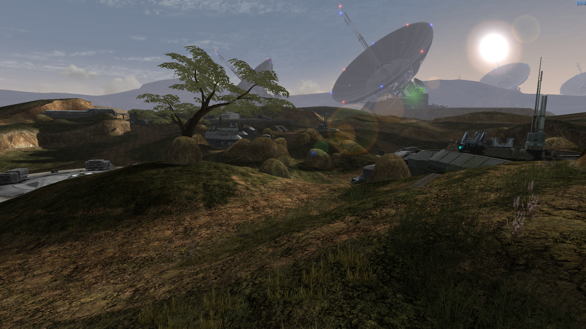

<html>
    <p align="center">
        
    </p>
</html>

The Flood: Feet First Into Hell is a mod for Halo: Custom Edition developed by the Keymind Dev Team, featuring an all-new campaign and a vast catalog of multiplayer maps.

The story follows the perspective of the human soldiers barricaded at Installation 04 during the events of the Battle for Alpha Halo, and their constant struggle to survive the insatiable assault of the Covenant and later the Flood; It mixes elements of strategy and terror with the already classic Halo formula that have made this franchise legendary since more than two decades.

The multiplayer section is comprised of original maps and remakes of aclaimed classics, and a rich sandbox built on the foundations of previous Halo titles.

# Getting The Flood Multiplayer
Get the latest version available using [Mercury](https://github.com/Sledmine/Mercury/releases)
with the following line on the terminal:
```
mercury install thefloodmp
```
Or you can install the package using the new Mercury UI 


It also uses [Chimera](https://github.com/SnowyMouse/chimera), lua scripting is another function
being used from this.

# Screenshots

We have 4 maps by now and others on development too.

Treason


Bleed It Out


Last Voyage


Impasse

